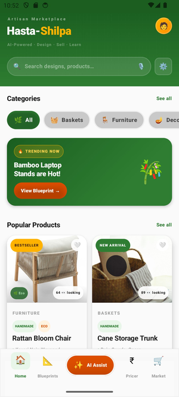
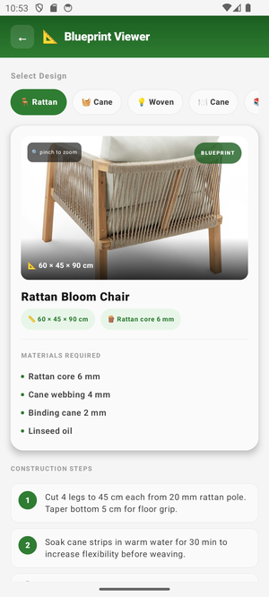
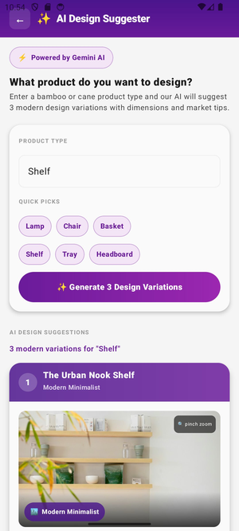
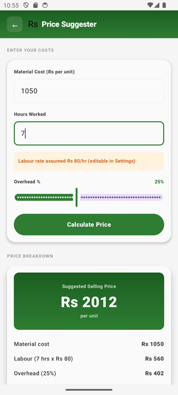

<div align="center">


<br/>

[](https://developer.android.com)
[](https://kotlinlang.org)
[](https://developer.android.com/jetpack/compose)
[](https://ai.google.dev)
[](https://developer.android.com/training/data-storage/room)
[](LICENSE)
[](https://github.com/nishant-kumar0708/HastaShilpaApp)
[](https://developer.android.com)

<br/>


<br/>

> **"Bridging traditional bamboo craft with modern urban markets — entirely offline, entirely in your hands."**

<br/>

[🎯 Problem](#-problem-statement) · [✨ Features](#-features) · [📸 Screenshots](#-screenshots) · [🛠️ Tech Stack](#️-tech-stack) · [🚀 Getting Started](#-getting-started) · [📁 Structure](#-project-structure) · [🔭 Roadmap](#-roadmap)

<br/>

</div>

---

## 🎯 Problem Statement

India's **Western Ghats** — Wayanad, Coorg, Sirsi, Agumbe — are home to thousands of skilled **bamboo and cane artisans** whose products are crafted with generations of expertise. Yet these artisans face a structural gap that erodes their livelihoods every single day:

<br/>

<div align="center">

| 🔴 Challenge | 💥 Impact | ✅ Hasta-Shilpa Solution |
|:---|:---|:---|
| 📉 Designs stuck in the past | Products don't sell in urban markets | AI-powered design trend feed with 16+ modern products |
| 💸 No pricing knowledge | Consistently underpricing and losing income | Smart price formula: `(Material + Labour) × (1 + Overhead%)` |
| 🌐 Zero market visibility | Buyers never discover them | Simulated marketplace with live buyer preview cards |
| 📵 No connectivity in villages | Digital tools simply don't work | 100% offline-capable — Room DB + OfflineCache |
| 🎨 No design inspiration | Cannot create modern product variations | Gemini 2.0 Flash generates 3 AI design variations on demand |

</div>

<br/>

**Hasta-Shilpa** solves all five — with a single Android app that works **fully offline**, speaks through visuals, and puts AI-powered design intelligence directly in an artisan's hands.

---

## ✨ Features

<details open>
<summary><b>🏠 Design Trend Feed</b> — Real-time artisan marketplace</summary>
<br/>

- Scrollable **2-column product grid** with 16+ bamboo & cane products
- Real product images via **Unsplash API** with in-memory deduplication cache
- **Category filters** — All · Furniture · Baskets · Lighting · Decor · Bamboo
- Each card: artisan name, location, ⭐ star rating, price with discount, **Eco badge**
- Animated ❤️ wishlist and ➕ Add-to-Cart interactions
- **Buyer interest signal** — "X 👀 looking" per product
- Trending banner with direct blueprint deep-link

</details>

<details>
<summary><b>📐 Blueprint Viewer</b> — 10 detailed product blueprints</summary>
<br/>

- **10 product blueprints** spanning all categories
- Pinch-to-zoom on high-quality product reference images
- Precise **cm/mm dimension annotations** per blueprint
- **8-step construction instructions** per design
- **Download as PDF** to device storage via Android PdfDocument API
- Category filter chips for instant blueprint navigation
- Fully offline-cached for workshop use without internet

</details>

<details>
<summary><b>🤖 GenAI Design Suggester</b> — Powered by Gemini 2.0 Flash</summary>
<br/>

- Type any product idea or select from **6 quick-pick chips** (Lamp · Chair · Basket · Shelf · Tray · Headboard)
- Gemini generates **3 unique design variations** per request
- Each AI design card returns:
  - 🏷️ Design name & style tag (e.g. *Modern Minimalist, Bohemian*)
  - 📐 Dimensions, materials list, estimated build time
  - 💰 Price range & urban market positioning tip
  - 🖼️ Unique contextual image from Unsplash with **pinch-to-zoom**
- Pure `HttpURLConnection` — **zero extra library dependency**

</details>

<details>
<summary><b>₹ Smart Price Suggester</b> — Fair pricing for every artisan</summary>
<br/>

- Formula: `Suggested Price = (Material Cost + Labour Cost) × (1 + Overhead%)`
- Auto-calculated labour from **configurable hourly rate** (default ₹80/hr)
- Full **profit margin breakdown card** — material · labour · overhead · margin
- Wired to `PricerViewModel` with `StateFlow` for reactive UI updates

</details>

<details>
<summary><b>📦 Material Tracker</b> — Room-persisted batch logging</summary>
<br/>

- Log batch entries: product name · bamboo poles · cane strips · production date
- **True persistence via Room Database** — data survives app restarts
- Batch history list with **running totals** per material
- Export entire batch history as a **formatted PDF report**
- Edit & delete individual batch entries

</details>

<details>
<summary><b>🛒 Simulated Marketplace</b> — Build listing literacy</summary>
<br/>

- Create product listings: title · description · price · category chip
- **Live buyer preview card** that updates in real-time as you type
- Shows artisans exactly how their product appears to urban buyers
- Wired to `MarketplaceViewModel` with full `StateFlow` state management

</details>

<details>
<summary><b>📊 Progress Dashboard</b> — Business intelligence at a glance</summary>
<br/>

- Monthly earnings **hero card** with estimated income
- **Weekly stats grid**: batches completed · bamboo poles · cane strips · total earnings
- Per-product breakdown table with performance metrics
- Efficiency analysis to identify peak productive periods

</details>

<details>
<summary><b>🔐 Authentication System</b> — Secure multi-mode login</summary>
<br/>

- ✉️ Email / Password login & registration
- 📱 Phone number login & registration
- 👤 Guest / Browse mode — no account required
- **SHA-256 password hashing** before Room DB storage
- Session persistence via `SharedPreferences` — stay logged in
- Profile dialog showing full user details from Room DB
- Full logout with complete session clear

</details>

<details>
<summary><b>🌐 Offline-First Operation</b> — Works anywhere, always</summary>
<br/>

- Blueprints and feed cards cached via `OfflineCache.kt` (file-based, app `cacheDir`)
- 🟠 Orange offline banner when network unavailable
- `NetworkUtils.kt` real-time connectivity detection
- `Room Database` as primary data store — **zero network dependency** for core features
- `EncryptedSharedPreferences` (AES-256) for secure local preference storage

</details>

---

## 📸 Screenshots

<div align="center">

<br/>

<table>
  <tr>
    <td align="center" width="25%">
      <br/><br/>
      <br/><br/>
      <sub><b>Artisan Marketplace</b></sub><br/>
      <sub>Real product images · Category filters · Buyer signals · Trending banner</sub>
    </td>
    <td align="center" width="25%">
      <br/><br/>
      <br/><br/>
      <sub><b>Blueprint Viewer</b></sub><br/>
      <sub>10 blueprints · Pinch-to-zoom · Dimensions · PDF download</sub>
    </td>
    <td align="center" width="25%">
      <br/><br/>
      <br/><br/>
      <sub><b>GenAI Suggester</b></sub><br/>
      <sub>Gemini 2.0 Flash · 3 design variations · Market tips</sub>
    </td>
    <td align="center" width="25%">
      <br/><br/>
      <br/><br/>
      <sub><b>Smart Pricing</b></sub><br/>
      <sub>Fair price formula · Full cost breakdown · Profit margin</sub>
    </td>
  </tr>
</table>

<br/>

```
🏠 Home Feed                    📐 Blueprint Viewer
━━━━━━━━━━━━━━━━━━━━━━━━━━━━    ━━━━━━━━━━━━━━━━━━━━━━━━━━━━
✓ 16+ bamboo & cane products    ✓ 10 detailed blueprints
✓ Real Unsplash product images  ✓ Pinch-to-zoom on images
✓ Category filter chips         ✓ Precise cm/mm dimensions
✓ Animated wishlist & cart      ✓ 8-step construction guide
✓ Buyer interest signals        ✓ PDF download to device

🤖 AI Design Suggester          ₹ Price Suggester
━━━━━━━━━━━━━━━━━━━━━━━━━━━━    ━━━━━━━━━━━━━━━━━━━━━━━━━━━━
✓ Powered by Gemini 2.0 Flash   ✓ (Material + Labour) × Overhead
✓ 3 unique design variations    ✓ Configurable labour rate
✓ Dimensions & materials        ✓ Full profit breakdown card
✓ Market positioning tips       ✓ PricerViewModel + StateFlow
✓ Unsplash contextual images    ✓ Instant price recalculation
```

</div>

---

## 🎬 Demo

<div align="center">

> 📹 **[Watch Demo Video](https://drive.google.com/file/d/1uY2PgIEqrkicCF3WHs3wPiGTLQHTqST7/view?usp=sharing)** ← COMING SOON....................

[]https://drive.google.com/file/d/1uY2PgIEqrkicCF3WHs3wPiGTLQHTqST7/view?usp=sharing)

</div>

---

## 🛠️ Tech Stack

<div align="center">

| Layer | Technology | Version | Purpose |
|:------|:-----------|:-------:|:--------|
| **Language** |  Kotlin | 2.1.0 | Primary development language — null safety, coroutines, DSL |
| **UI Framework** |  Jetpack Compose + Material 3 | BOM 2024.x | All screens, composables, animations |
| **Architecture** | MVVM + Repository Pattern | — | Clean 5-ViewModel separation of concerns |
| **Navigation** | Navigation Compose | 2.7.x | NavHost with 9 routes + back-stack management |
| **Local Database** |  Room | 2.7.0 | Batch logs + user credentials persistence |
| **Preferences** | EncryptedSharedPreferences (AES-256) | — | Secure local storage for pricing & session data |
| **Image Loading** | Coil | 2.6.0 | Kotlin-native async image rendering with cache |
| **Image Source** | Unsplash API | — | Real product & blueprint photos |
| **Generative AI** |  Google Gemini 2.0 Flash | v1beta | AI design suggestion engine — 3 JSON design cards |
| **HTTP Client** | HttpURLConnection | Built-in | Zero-dependency Gemini & Unsplash API calls |
| **JSON Parsing** | org.json JSONObject / JSONArray | Built-in | Gemini response parsing with `optString()` fallbacks |
| **PDF Generation** | Android PdfDocument API | Built-in | Blueprint download + batch report export |
| **Security** | SHA-256 MessageDigest | Built-in | Password hashing before Room DB storage |
| **Offline Cache** | File I/O → app `cacheDir` | Built-in | Blueprint & feed card offline access |
| **Network Check** | ConnectivityManager | Built-in | Offline banner detection |
| **Min SDK** | Android 8.0 | API 24 | Supports affordable mid-range smartphones |
| **Target SDK** | Android 15 | API 35 | Latest Android platform features & security |
| **Build System** | Gradle with Kotlin DSL | — | Type-safe `.kts` build configuration |

</div>

---

## 🚀 Getting Started

### Prerequisites

Before you begin, ensure you have:

- [**Android Studio Hedgehog**](https://developer.android.com/studio) or newer
- Android device or emulator running **API 24+**
- Free [**Unsplash Developer Account**](https://unsplash.com/developers) — 50 req/hr
- Free [**Google Gemini API Key**](https://aistudio.google.com/app/apikey) — 15 req/min

---

### Installation

**Step 1 — Clone the repository**

```bash
git clone https://github.com/nishant-kumar0708/HastaShilpaApp.git
cd HastaShilpaApp
```

**Step 2 — Create `local.properties` in the project root**

```properties
# local.properties — this file is gitignored, never commit it
sdk.dir=YOUR_ANDROID_SDK_PATH
UNSPLASH_ACCESS_KEY=your_unsplash_access_key_here
GEMINI_API_KEY=your_gemini_api_key_here
```

> ⚠️ `local.properties` is gitignored for security. Every contributor needs their own free API keys from the links above. The original developer's keys are stored locally and the app works fully.

**Step 3 — Sync Gradle**

```
File → Sync Project with Gradle Files
```

**Step 4 — Run the app**

```bash
# Option A — Gradle command line
./gradlew installDebug

# Option B — Android Studio
Run → Run 'app'   (Shift + F10)
```

---

### Quick API Key Guide

```
Unsplash (Product & Blueprint Images)
  → Sign up at unsplash.com/developers
  → Create a new application
  → Copy the "Access Key"
  → Free tier: 50 requests/hour ✓

Google Gemini (AI Design Suggestions)
  → Visit aistudio.google.com/app/apikey
  → Click "Create API Key"
  → Copy the key
  → Free tier: 15 requests/minute ✓
```

---

## 📁 Project Structure

```
app/src/main/java/com/hastashilpa/app/
│
├── 📄 MainActivity.kt                  ← Home screen · product cards · bottom nav · design tokens
│
├── 📂 data/
│   ├── BatchDatabase.kt                ← Room DB — @Database, BatchLog entity, UserEntity
│   ├── AuthRepository.kt               ← Login · register · SHA-256 password hashing
│   └── AppPreferences.kt               ← SharedPreferences wrapper — session flags
│
├── 📂 navigation/
│   └── AppNavGraph.kt                  ← NavHost with 9 routes — startDestination from SharedPrefs
│
├── 📂 ui/screens/
│   ├── AuthScreen.kt                   ← Email / Phone / Guest login & registration UI
│   ├── Screens.kt                      ← Blueprint · Tracker · Pricer · Marketplace screens
│   ├── GenAiDesignScreen.kt            ← AI Design Suggester — Gemini API · 3 design cards
│   ├── OnboardingScreen.kt             ← 3-page animated first-launch onboarding
│   └── ProgressDashboardScreen.kt      ← Earnings hero · weekly stats · product breakdown
│
├── 📂 viewmodel/
│   ├── AuthViewModel.kt                ← Auth state · login · logout · currentUser StateFlow
│   ├── GenAiViewModel.kt               ← Gemini API call · JSON parsing · DesignSuggestion model
│   ├── TrackerViewModel.kt             ← Batch CRUD via Room — addBatch · deleteBatch · StateFlow
│   ├── PricerViewModel.kt              ← Price formula · materialCost · hoursWorked · overhead
│   └── MarketplaceViewModel.kt         ← Listing state — updateTitle · updatePrice · previewListing
│
└── 📂 util/
    ├── UnsplashImageFetcher.kt         ← Unsplash API with in-memory deduplication cache
    ├── UnsplashImage.kt                ← Reusable @Composable image component with shimmer
    ├── ProductImageUrls.kt             ← Search query builder per product name & category
    ├── PdfExporter.kt                  ← Blueprint PDF + batch report PDF via PdfDocument API
    ├── OfflineCache.kt                 ← File-based offline cache → saveText · readText · exists
    ├── NetworkUtils.kt                 ← isOnline() via ConnectivityManager
    └── SecurePrefs.kt                  ← AES-256 EncryptedSharedPreferences wrapper
```

---

## 🔑 API Keys

<div align="center">

| API | Purpose | Free Tier | Get Key |
|:---|:---|:---:|:---|
|  **Unsplash** | Product & blueprint images | **50 req/hr** | [unsplash.com/developers](https://unsplash.com/developers) |
|  **Google Gemini** | AI design suggestions | **15 req/min** | [aistudio.google.com](https://aistudio.google.com/app/apikey) |

</div>

---

## 🔭 Roadmap

<div align="center">

| Version | Feature | Status |
|:-------:|:--------|:------:|
| **v2.0** | 🔥 Firebase Firestore — cloud backup & real-time sync (NFR14) | 🗓️ Planned |
| **v2.0** | 🌐 Multi-language support — Kannada · Marathi · Telugu | 🗓️ Planned |
| **v2.0** | 📸 Camera integration — artisans photograph products for listings | 🗓️ Planned |
| **v2.1** | 💳 Real payment gateway — Razorpay / Google Pay integration | 🗓️ Planned |
| **v2.1** | 🏗️ ARCore blueprint overlay on physical workspace | 🗓️ Planned |
| **v2.2** | 🤝 Community gallery — artisans share & vote on finished designs | 🗓️ Planned |
| **v2.2** | 🔔 Push notifications — weekly new blueprint drop alerts | 🗓️ Planned |
| **v3.0** | 🌍 iOS version via Kotlin Multiplatform | 🔭 Future |

</div>

---

## 🌿 Our Mission

<div align="center">

**Hasta-Shilpa (हस्तशिल्प)** means **"handicraft"** in Sanskrit.

<br/>

This app was built for the bamboo and cane artisan communities of India's Western Ghats —

### 🌄 Wayanad · Coorg · Sirsi · Agumbe

<br/>

These artisans possess skills refined across generations. They deserve access to the same design intelligence, pricing tools, and market visibility that modern businesses take for granted — **not as a luxury, but as a right.**

<br/>

*Hasta-Shilpa puts that power in their hands.*
*Offline. In their language. On a ₹6,000 phone.*

<br/>

| 🎯 Impact Goal | Description |
|:---|:---|
| 🪴 **Artisanal Modernisation** | Keep traditional bamboo/cane crafts relevant in 21st-century urban markets |
| 💰 **Economic Growth** | Increase per-unit value through better design, pricing intelligence, and market access |
| 🌱 **Sustainable Material** | Promote bamboo as a green alternative to plastic and metal |
| 📱 **Digital Literacy** | Onboard rural artisans onto smartphone tools through a visual, low-text interface |

</div>

---

## 👨‍💻 Developer

<div align="center">

Built with ❤️ for Indian handicraft artisans.

[](https://github.com/nishant-kumar0708/HastaShilpaApp)
[](https://linkedin.com/in/nishant-kumar-dutta)

</div>

---

## 📄 License

```
MIT License

Copyright (c) 2026 Nishant Kumar Dutta

Permission is hereby granted, free of charge, to any person obtaining a copy
of this software and associated documentation files (the "Software"), to deal
in the Software without restriction, including without limitation the rights
to use, copy, modify, merge, publish, distribute, sublicense, and/or sell
copies of the Software, subject to the following conditions:

The above copyright notice and this permission notice shall be included in all
copies or substantial portions of the Software.

THE SOFTWARE IS PROVIDED "AS IS", WITHOUT WARRANTY OF ANY KIND, EXPRESS OR
IMPLIED, INCLUDING BUT NOT LIMITED TO THE WARRANTIES OF MERCHANTABILITY,
FITNESS FOR A PARTICULAR PURPOSE AND NONINFRINGEMENT.
```

---

<div align="center">


<br/>

*Empowering artisans, one app at a time.* 🌿

**⭐ Star this repo if Hasta-Shilpa inspires you!**

[](https://github.com/nishant-kumar0708/HastaShilpaApp/stargazers)
[](https://github.com/nishant-kumar0708/HastaShilpaApp/network/members)

</div>
